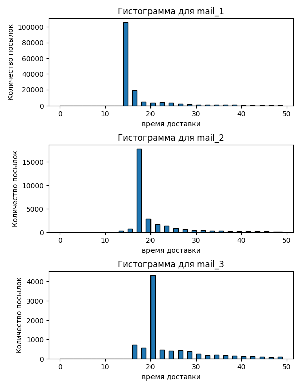
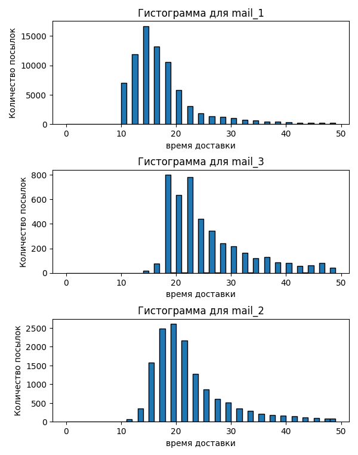

# Курс по моделирование 2023/2024

## Создание модели склада

Цель данного курса создание итерационной модели склада.\
Модель должна моделировать работу автоматизированого склада с использование роботов. \
В качестве управляющего алгоритма используеться муравьиный.

## Как запустить?

Просто введите это в консоль:

```
git clone https://github.com/Quargam/Modeling-course-2023.git
cd Modeling-course-2023
python -m venv venv
venv/Scripts/activate
pip install -r reqirements.txt
bash examples/square_storage/run.sh
```

## Как создать модель пользовательского склада?

Параметры модели склада задаются с помощью **yaml** файла. Пример такого файла вы можете посмотреть в папку *examples*.

## Анализ и визуализация результата

Чтобы построить гистограммы посылок введите это в консоль:

```
cd Modeling-course-2023
python main.py analys log_file.csv
```

Пример гистограмм на 100000 посылок. Результат двух попыток обучения:

<!--   -->
<p align="center">
  
  
</p>
